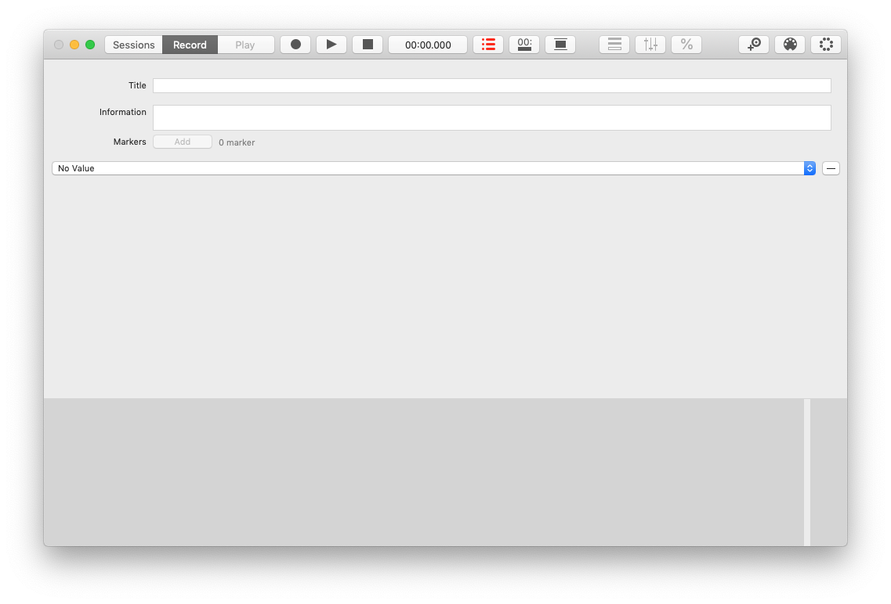
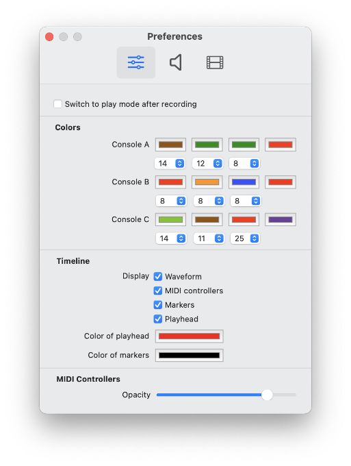

#  MotusLabTool Manual

## Configure audio

The input and output audio are the same as those of the computer's system preference settings.

Before opening MotusLabTool :

1. Open the system preferences.
2. Select `Sound`.
3. Select audio input and output.
4. Launch the software.
5. Use menu `MotusLabTool` > `Preferences` to edit settings of audio recording.

> MotusLabTool can record and play in multitracks up to 8 channels. 
> See `Preferences` to select the channel number.

## Configure the MIDI

Use the toolbar button . The window displays all MIDI settings:

`Value correction`: Displays the corrected fader values for the selected mix table.

`Console B`: Activate or not the second mix console.

`Input`: Select the MIDI input device for each mix console.

`Output`: Select the MIDI output device for each mix console.

`Channel`: Select the MIDI channel for each mix console (`All` is the default value).

`Mapping`: Configure the MIDI mapping (see below).

### Configure the MIDI Mapping

Fill in the MIDI controller numbers you want to record for each console.

You can fill them in 3 ways:

1. A list of numbers separated by a space. Eg. `1 3 3 5 5 7 9`.
2. A range of numbers with the first and last one with a dash. Eg. `1-10` means controllers from 1 to 10.
3. A combination of the first two ways. Eg. `1-10 15 18-21`.

You can also use the learning techniques:

1. By pressing the `Learn All` button: Move all controllers to be recorded.
2. By pressing the `Learn` button: Move a single controller to record it.

Some consoles will not work with the `Learn All` button, they will record more controllers than desired.

## Configure the playlist

When recording, you can record the audio from the computer input or play back an audio file. The playlist is used to organize the files to be played back during recording.

> Audio files must be located in the user's Music folder. Other files cannot be added to the playlist.

Use the toolbar button  to open the playlist:

`Use playlist`: Activate the playlist. Uncheck to record audio from input of computer. When this function is enabled, the toolbar icon turns red ()

`+`: Add one or more files to the playlist.

> MotusLabTool only accepts WAV, AIFF, MP3, and M4A formats.  
> If it is a PCM format (WAV or AIFF), MotusLabTool accepts multitrack files up to 8 channels.

`-`: Remove one file from the playlist.

Select the file you want to use during recording.

## Record

### Create a new project

Use menu `File` > `New` to create a new project:

### Add cameras

Select a camera from the drop-down menu instead of No value. You can add more cameras (up to 4) with the button  in the toolbar.

> Video is recording in H264, 960 x 540 pixels.

### Record a performance

Use the toolbar button  to start and stop recording. You also can use the space bar. Each recording produce a session in the same project.

During the recording, you can edit `Title` and `Information` and `Add markers` (see below) for each session.

### Record with waveform and big counter

Use the toolbar button  to show the waveform and the big counter.

The waveform is only displayed if you select the playlist function.

Click in the waveform to select a specific starting position for the recording.

### Add markers

During the recording use Markers `Add` button, fill the `Title` and select `Save` to add a marker.

### Playback in record mode

When you are in record mode and if a playlist file is selected, you can use  and  to play playlist file without recording. Use click in the waveform if  is activated to naviguate in the audio file.

## Play

### Open a project

Use menu `File` > `Open` to open a project. Use  and  to command the playback.

### Select a session

Use toolbar button `Sessions` to select a session. Then select toolbar button `Play` to load the session.

In `Sessions` interface, you can edit `title` and `information` of each sessions.

### Show statistics

Use the toolbar button  to show the statistics window:

- Check `Show statistics` to display statistic values in front of fader representation.
- Then, check which statistic values you want to display on the graph.

## Acousmonium

Use the toolbar button  to display the acousmonium panel at right.

Acousmonium map can be used in play and record mode.

### Create a new acousmonium

Use the button  to open the property window:

`+`: Create a new acousmonium preset. 

`-`: Delete the selected acousmonium preset.

`Background image`: Use a background image (eg. the map of the acousmonium).

`Import image`: Select an image.

> MotusLabTool only accepts JPG and PNG formats.

`Edit graphic position`: Check to edit the loudspeaker positions.

`Opacity`: Change opacity of loudspeakers.

`Size`: Change size of loudspeakers.

`Titles`: Show or hide name of loudspeakers.

`+`: Add a loudspeaker.

`+`: Delete the selected loudspeaker.

When you add a loudspeaker, it is displayed on the interface of the main window as a circle. If you have activated `Edit graphic position`, you can move the circle with the mouse:

The list contains 3 values:

1. The name of the loudspeaker.
2. The console.
3. The MIDI controller number.

You can use multiple loudspeakers with the same MIDI controller number.

In order to ensure that the representation works properly during playback or recording, the MIDI controller numbers and console indications must be the same as those selected in the MIDI properties (see `Configure the MIDI` section).

## Various

### Black window

Use the button  to mask interface in record or play mode.

## Export recording

Use menu `File` > `Export Recording` to export the project in JSON format.

The exported project contains:

- An `audio` folder with audio files.
- A `movie` folder with movie files.
- A JSON file `motusLabFile.json` which contains project information, sessions, and MIDI events.

## Export a session

To create a copy of the project which only contain a session:
- Select `Sessions` toolbar button.
- Select a session.
- Use menu `File` > `Export Selected Session`.

## Import and export acousmonium

Use menu `File` > `Export Acousmonium` to export the selected acousmonium.

Use menu `File` > `Import Acousmonium` to import an acousmonium file.

> MotusLabTool only export and import acousmonium files in its format with `.acousmonium` extension.

## Preferences

Use menu `MotusLaTool` > `Preferences` to open preference window:

`Audio recording` settings are only available for PCM format (WAV). Multitracks recording (more than 2 channels) needs an external sound card.

## FAQ

### Sometimes camera does not work

1. Check that the power supply to the USB port is sufficient.
2. Disconnect and reconnect the camera.
3. Restart the software and try again to add the camera.

### Audio files are not recognized in the playlist

1. Check that the audio files are in `Music` folder of your account. Other locations are not recognized.
2. Check the format of your audio files: WAV, AIFF, MP3, and M4A are the only accepted formats.

### Video is not synchronized with controller's positions

1. Stop playback.
2. Change the time position and start playback.

Videos can be slightly shifted, this is normal.
