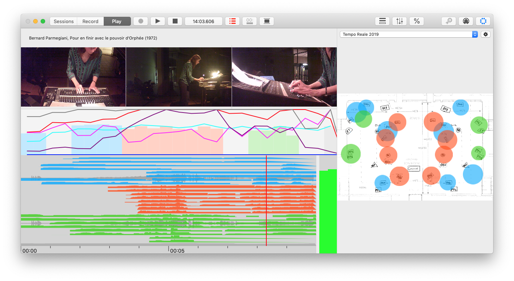

#  MotusLabTool

> Current version is 2.1

Next Generation of [MotusLab Recorder](https://github.com/pierrecouprie/MotusLabRecorder), [MotusLab Reader](https://github.com/pierrecouprie/MotusLabReader), and [MotusLab Live](https://github.com/pierrecouprie/MotusLabLive)

MotusLabTool is a software developed to record acousmatic music interpretation. It records audio, video, and MIDI messages.

## Research team

* Development and research: Pierre Couprie ([Institute for research in Musicology](http://www.iremus.cnrs.fr/))
* Research: Nathanaëlle Raboisson ([Motus Music Company](https://motus.fr/) and [Institute for research in Musicology](http://www.iremus.cnrs.fr/))
* Consulting: Olivier Lamarche ([Motus Music Company](https://motus.fr/))

## Acousmatic music interpretation

MotusLabTool is the result of a musicological research on the recording and analysis of acousmatic music.

Acousmatic music is only composed on a support and performed on a looudspeaker orchestra (called ‘acousmonium’). The interpreter distributes the sound from the support to the loudspeakers using one or more mixing tables. To study these interpretations, MotusLabTool allows you to record the motions of the mixers' faders, the audio used by the musician and up to 4 webcams.

Different representations are available:

* Representation of the faders of the mixing consoles
* Time representation of the audio waveform, potentiometer graphs and markers
* Representation of the opening of the loudspeakers on the installation plan in the concert hall.

More [information](http://www.iremus.cnrs.fr/fr/programme-de-recherche/analyse-de-linterpretation-acousmatique).

## Why a new implementation?

Original implementation was developed in Max (Cycling74) and there were lots of limitations and issues with video recording of webcams and graphical representations.

Then I will rewrite the software code in Swift. You are able to open project created with MotusLabTool in [iAnalyse 5](http://ianalyse5.pierrecouprie.fr).

## Requirements

### Running

- macOS 10.13.6+

### Building

- Xcode 11.0+

## Download

Download binary [here](https://github.com/pierrecouprie/MotusLabTool/releases)

## Manual

[Manual](https://github.com/pierrecouprie/MotusLabTool/blob/master/MotusLabTool/Resources/Manual/Manual.md)

## License

MotusLabTool is released under the GNU General Public License. See [LICENSE](https://github.com/pierrecouprie/MotusLabTool/blob/master/LICENSE.md) for details.

